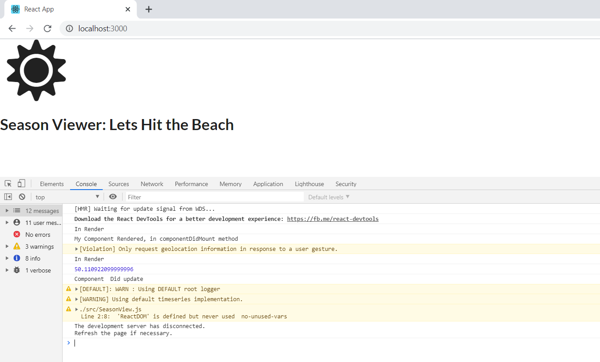

@Author: Pawan Garia

This project was bootstrapped with [Create React App](https://github.com/facebook/create-react-app).

## About:
This project is an example for Learning How the Class Components works in React and How they re different from the methods or Function components.
We will be creating the application which can read the Geographical Location of the browser and month and then decide the case.  What is the season you have and change the same React single page application?

## Challenges:

### Getting the Location of the user from Browser??
using API : https://developer.mozilla.org/en-US/docs/Web/API/Geolocation_API
### Getting the Date and Month??
### Create the logic based on the month and Location then fill the component??

## CSS StyleSheet Reference
Using the https://semantic-ui.com for the CSS styleSheet.
https://cdnjs.cloudflare.com/ajax/libs/semantic-ui/2.4.1/semantic.min.css"

## What functionalities 

## Final Result
   

## Available Scripts

In the project directory, you can run:

### `yarn start` or `npm start`

Runs the app in the development mode. 
Open [http://localhost:3000](http://localhost:3000) to view it in the browser.

The page will reload if you make edits. 
You will also see any lint errors in the console.