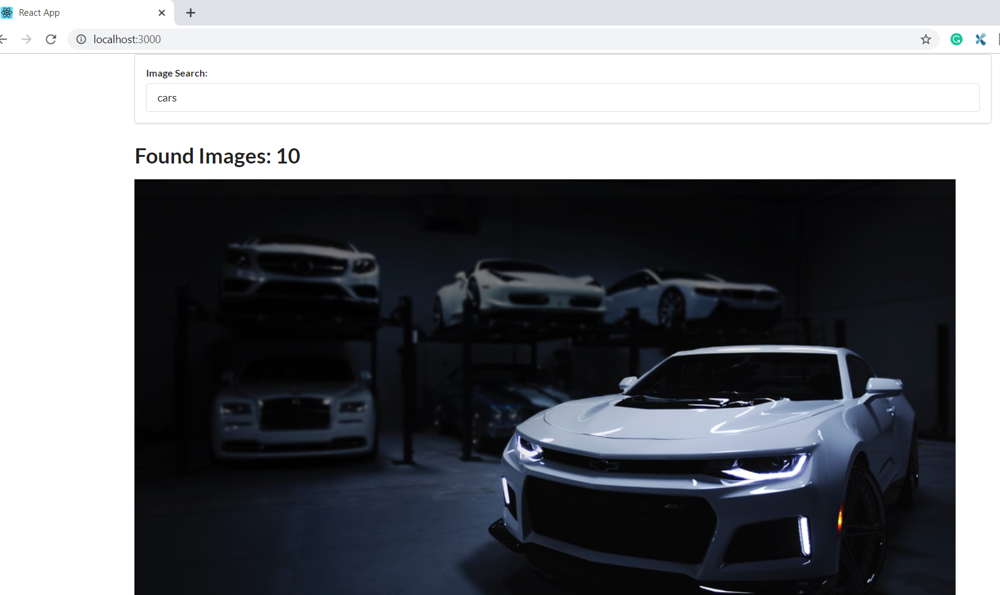

@Author: Pawan Garia

This project was bootstrapped with [Create React App](https://github.com/facebook/create-react-app).

## About:
This project is an example for learning and crating an example app for the user evernts like entering text, clicking on the textfiled forms etc. and then we have to get the list of Images for example and how to display them in the page using the multiple react componenets. This is the Version 1 where we just display the List with out any Styling.

## Learn about:
Learn about User Events and Fetching Lists with multiple React component.

### Challenge for this App V1.
1. Getting a Search Text from the User.
2. Use the Text entered by User and Do an API call to an Open Service and Fetch the Data.
3. Taking the Response data from the service and Display the List on the Screen.

## Steps:

### SearchBar
Create a Simple Text Field Based searchBar Component.
Now in the Form there is a Text field which takes the Values from User.
We have to now use State and store this Value in the React State.
When User press Enter button the Default Fucntionality of Form will Refresh the Page. To prevent this Page reload we have to Use preventDefault() method on Form Submit Event.
Now we have a Text Field Which Takes Value and the Value can be Stored and retrieved.

### Api Request
Using https://unsplash.com/ to get the Images over the API.
Using the Ajax client for the Api as React has nothign to do with API calls.
Axios (https://github.com/axios/axios) as 3rd party library for the netwok request related functions using `npm install --save axios`

### Image List Component
We will create a new component just to take the Images list from the response.
Get the Urls and Display the Images on the Browser.

## Final Result
Our Final solution for Showing the Images based on the Search is Ready

   

## Available Scripts

In the project directory, you can run:

### `yarn start` or `npm start`

Runs the app in the development mode. 
Open [http://localhost:3000](http://localhost:3000) to view it in the browser.

The page will reload if you make edits. 
You will also see any lint errors in the console.